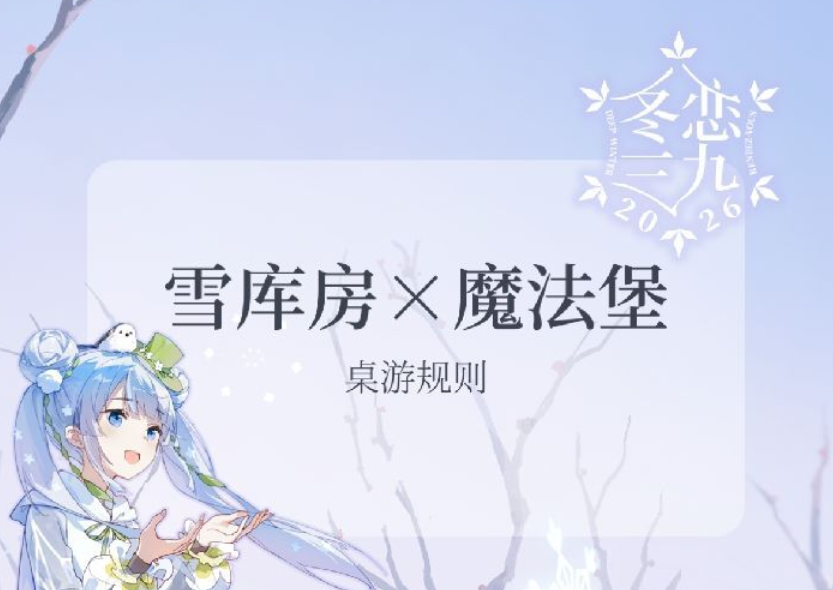

# 雪库房×魔法堡



> 桌游规则来自「冬恋三九」

⚠️ **声明**：本项目为同人爱好者实现的网页版桌游，并非桌游设计者，与官方无关。

🎮 **在线游玩**：已部署服务器，可直接访问体验！

🤖 **关于项目**：本项目由 AI 辅助创作，可能存在不少 bug，欢迎大家提出问题或协助完善！

一款支持本地对战和远程联机的网页版桌游。

## 功能特性

- **本地对战**: 两人同屏轮流操作
- **在线对战**: 创建房间，分享链接邀请好友加入
- **实时同步**: WebSocket 实现即时通信
- **AI 接口预留**: 可扩展 AI 对战功能

## 快速开始

### 1. 安装依赖

```bash
cd backend
pip install -r requirements.txt
```

### 2. 启动服务器

```bash
cd backend
python main.py
```

或者使用 uvicorn:

```bash
cd backend
uvicorn main:app --host 0.0.0.0 --port 8000 --reload
```

### 3. 访问游戏

打开浏览器访问: http://localhost:8000

## 项目结构

```
miku_chess_v1/
├── backend/
│   ├── main.py           # FastAPI 入口
│   ├── game_logic.py     # 游戏规则逻辑
│   ├── game_state.py     # 状态管理
│   ├── ai_interface.py   # AI 接口 (预留)
│   └── requirements.txt
├── frontend/
│   ├── index.html        # 主页面
│   ├── css/style.css     # 样式
│   └── js/
│       ├── board.js      # 棋盘渲染
│       ├── game.js       # 游戏逻辑
│       └── network.js    # 网络通信
└── 规则.txt              # 游戏规则说明
```

## 游戏规则

详见 `规则.txt` 或查看 [📜 详细规则图片](asset/桌游详细规则.png)

### 棋子类型

| 棋子 | 名称   | 移动规则                   |
| ---- | ------ | -------------------------- |
| 攻   | 进攻棋 | 横纵线任意格数，纵向可吃子 |
| 守   | 防守棋 | 横纵线任意格数，横向可吃子 |
| 援   | 应援棋 | 斜线任意格数，可吃敌方棋子 |
| 法   | 魔法阵 | 中心区域内每步1格          |
| 将   | 胜点棋 | 九宫格内每步1格            |

### 特殊规则

- 魔法阵被吃后，该方棋子不能后退
- 第11回合魔法效果触发:
  - 蓝方魔法阵存活: 蓝区红子被冻结
  - 红方魔法阵存活: 红区红子可移动两次

## 扩展 AI 对战

在 `backend/ai_interface.py` 中实现 `AIPlayer` 接口:

```python
class MyAI(AIPlayer):
    @property
    def name(self):
        return "My AI"
  
    @property
    def difficulty(self):
        return "medium"
  
    def get_move(self, game_state):
        # 实现你的 AI 逻辑
        pass
  
    def evaluate_position(self, game_state):
        # 局面评估
        pass
```

然后注册到 `AI_REGISTRY`:

```python
AI_REGISTRY["my_ai"] = MyAI
```

## 技术栈

- **后端**: Python, FastAPI, WebSocket
- **前端**: 原生 HTML/CSS/JavaScript
- **通信**: REST API + WebSocket

## 许可

MIT License

---

## 关于「冬恋三九」

本桌游规则来源于 **冬恋三九** 活动，本项目仅为同人爱好者根据桌游规则实现的网页版本，**与官方无任何关联**。

如果你对原版桌游活动感兴趣，欢迎关注官方渠道获取更多信息：


**冬恋三九的观众群**：QQ群 `1022442412`

> 以上信息来自活动官方，本项目开发者并非活动官方成员。
